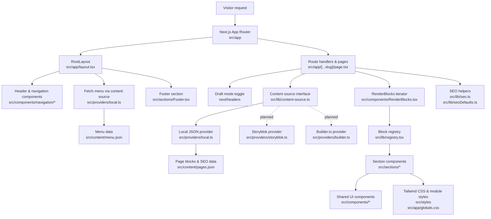

## Architecture Overview

The project is driven by the Next.js App Router and a content-sourcing abstraction that feeds modular page sections. The flowchart below highlights how requests move through the system and where key pieces live in the repository.

**Notes**
- Draft mode keeps the same rendering pipeline but flags providers to return preview content when available.
- Additional providers (Storyblok, Builder) are scaffolded for future integration through the shared `ContentSource` contract.
- Section components remain presentation-focused and can be composed in Storybook for isolated iteration.
